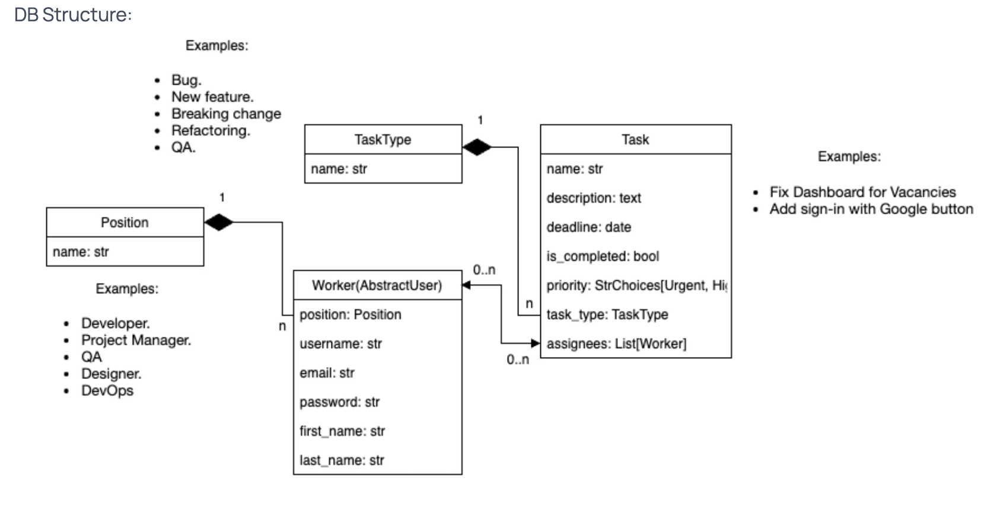

# Task Master

Task Master - is a program that helps people better organize their tasks. It allows you to create a to-do list,
set deadlines and track progress. A task manager helps you not forget important tasks, plan your time effectively,
and achieve your goals.

## Check it out!

Task master project deployed to render
https://task-master-xgjz.onrender.com/

For login use following login and password:
* Login: `john`
* Password: `ewq321dsa`


## Installation instructions

For beginning you have to install Python3+.

In terminal write down following command:
```shell
git clone https://github.com/juliastetsko/task-master.git
python -m venv venv
source venv/bin/activate  # for Windows use: venv\scripts\activate
pip install -r requirements.txt
python manage.py migrate
python manage.py collectstatic
python manage.py runserver
```

## Database Structure



## Home page

